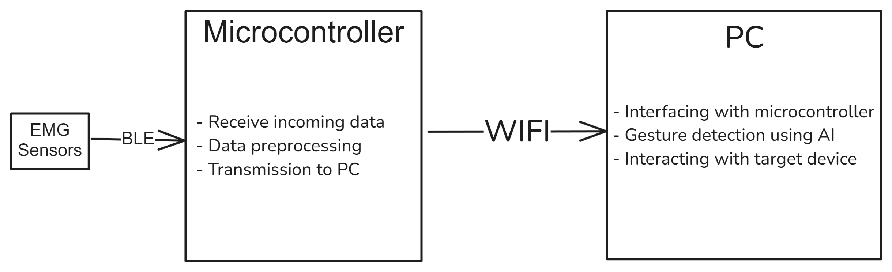
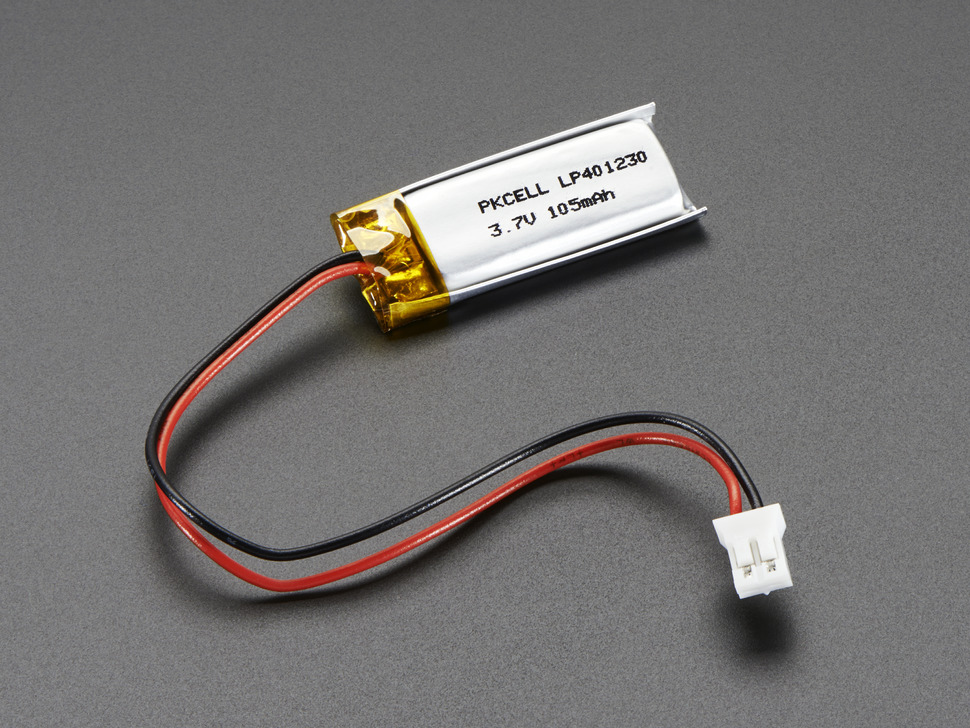
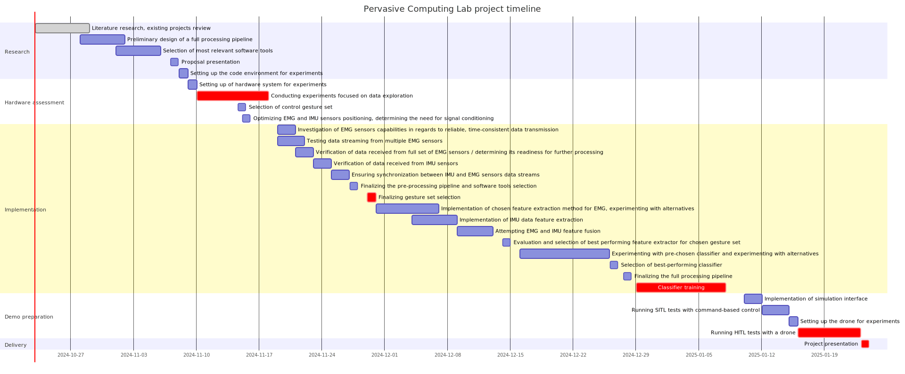

# Real-Time Gesture Control System for Precision Control

## Problem definition

The traditional interface tools, such as keyboards, mice, and joysticks, lack the precision and accessibility necessary for people with movement disabilities. Additionally, current systems are limited in enabling real-time, continuous communication with both hardware and software applications.\
This project aims to extend these capabilities, providing a more adaptable, precise, and inclusive solution for users who require enhanced control and seamless interaction.

## Proposed solution

The solution will be a combined system consisting of a local data acquisition device and an external data processing hub, utilizing the computing power of a PC. The local device will be able to detect incoming signals, preprocess them, and send them for further processing and inference to the hub device. The hub device will identify a predefined set of gestures and send the corresponding control commands to a drone. We will demonstrate the functionality of the system using our own drone.

The proposed functionality includes:
- Data acquisition by combining EMG (electromyography) signals and IMU measurements
- Detecting a predefined set of movements
- Controlling applications (e.g., drones) via movements

Similar solutions have already been presented by [MIT](https://www.csail.mit.edu/research/controlling-drones-and-other-robots-gestures), but they are based on the deprecated Myo Thalmic Labs armband. Our solution aims to further explore data processing based on other research, such as ["Wavelet transform theory and its application in EMG signal processing"](https://ieeexplore.ieee.org/document/5569532). Additionally, there are demos available for our sensor of choice (uMyo EMG) demonstrating [control of a robot arm](https://www.youtube.com/watch?v=EQnulmIfGFc), for example.

System diagram:


## Hardware list

- **5x** [uMyo EMG sensor](https://udevices.io/products/umyo-wearable-emg-sensor?variant=40350046355520) (3x uMyo kit + 2x uMyo)
    - Small bracelet 25x290 mm
- **2x** 1s (~100mAh-200mAh) LiPo/Li-Ion battery with JST (PH2.0) connector
- **1x** ESP32 Microcontroller
- **1x** 3.3V Voltage Regulator for ESP32 (LDO would suffice)
- **1x** 1s (~500 mAh 1C) LiPo battery for ESP32 (ideally with protection circuit)
- **1x** TP4056 battery charger for ESP32
- **1x** IMU (6 or 9 DoF)
    - LSM6DSR
    - BNO055

### More on battery
The battery connector has to have + and - on right sides. Here's an [example](https://www.adafruit.com/product/1570) of a suitable battery for uMyo sensors:\


Optional (can be useful for experiments):
- [USB receiver for uMyo](https://udevices.io/products/usb-receiver-base)

Alternatives:
- Myo Thalmic Labs armband (discontinued)
- [MYOWARE 2.0](https://myoware.com/)
- [BioAmp EXG Pill](https://github.com/upsidedownlabs/BioAmp-EXG-Pill)

Reasoning behind uMyo being the best choice:
- Affordable price
- [Open source hardware and software](https://github.com/ultimaterobotics)
- Fast delivery
- Enables reliable usage of dry electrode which will reduce parts waste and costs during project implementation
- Active support for both hardware and software
- Suitable for both prototyping and integration into end project

## Potential software

- ESP IDF
    - [Bluetooth API](https://docs.espressif.com/projects/esp-idf/en/stable/esp32/api-reference/bluetooth/index.html)
    - [Wi-Fi](https://docs.espressif.com/projects/esp-idf/en/stable/esp32/api-reference/network/esp_wifi.html)
- ESP-DSP
  - If signal conditioning is needed for better SNR
- uMyo provided libraries
- Scipy
- Eigen
- ROS2
- Machine Learning
    - PyTorch
        - If a neural network is needed for gesture recognition
    - Scikit-Learn / MLPACK
        - For clustering in Python or C++

## Project timeline (Grantt chart)

<!-- ```mermaid
gantt
    title Pervasive Computing Lab project timeline
    section Research
        Literature research, existing projects review   :done,    2024-10-23, 6d
        Preliminary design of a full processing pipeline    :   2024-10-28, 5d
        Selection of most relevant software tools   :   2024-11-01, 5d
        Proposal presentation :milestone , 2024-11-07, 1d
        Setting up the code environment for experiments :   2024-11-08, 1d
    section Hardware assessment
        Setting up of hardware system for experiments      :                2024-11-09, 1d
        Conducting experiments focused on data exploration  :crit,   2024-11-10, 8d
        Selection of control gesture set :milestone,     2024-11-12, 6d
        Optimizing EMG and IMU sensors positioning, determining the need for signal conditioning :milestone,     2024-11-12, 7d
    section Implementation
        Investigation of EMG sensors capabilities in regards to reliable, time-consistent data transmission : 2024-11-19, 2d
        Testing data streaming from multiple EMG sensors : 2024-11-19, 3d
        Verification of data received from full set of EMG sensors / determining its readiness for further processing : 2024-11-21, 2d
        Verification of data received from IMU sensors : 2024-11-23, 2d
        Ensuring synchronization between IMU and EMG sensors data streams : 2024-11-25, 2d
        Finalizing the pre-processing pipeline and software tools selection :milestone, 2024-11-27, 1d
        Finalizing gesture set selection :crit, 2024-11-29, 1d
        Implementation of chosen feature extraction method for EMG, experimenting with alternatives : 2024-11-30, 7d
        Implementation of IMU data feature extraction : 2024-12-04, 5d
        Attempting EMG and IMU feature fusion : 2024-12-09, 4d
        Evaluation and selection of best performing feature extractor for chosen gesture set :milestone, 2024-12-13, 3d
        Experimenting with pre-chosen classifier and experimenting with alternatives : 2024-12-16, 10d
        Selection of best-performing classifier :milestone, 2024-12-26, 1d
        Finalizing the full processing pipeline :milestone, 2024-12-27, 2d
        Classifier training :crit, 2024-12-29, 10d
    section Demo preparation
        Implementation of simulation interface : 2025-01-10, 2d
        Running SITL tests with command-based control : 2025-01-12, 3d
        Setting up the drone for experiments : 2025-01-15, 1d
        Running HITL tests with a drone :crit, 2025-01-16, 7d
    section Delivery
        Project presentation    :milestone, crit,                2025-01-23, 1d
``` -->

## Members - Group 1

- Nadezhda Varzonova, 12244356
- Gilbert Tanner, 12210784 

<br />
<br />
<br />
<br />

## Reference material

- [Plug-and-Play Gesture Control Using Muscle and Motion Sensors](https://dl.acm.org/doi/pdf/10.1145/3319502.3374823)
- [Electromyography Gesture Identification Using CNN-RNN Neural Network for Controlling Quadcopters](https://iopscience.iop.org/article/10.1088/1742-6596/1858/1/012075/pdf)
- [Electromyogram-Based Classification of Hand and Finger Gestures Using Artificial Neural Networks](https://pmc.ncbi.nlm.nih.gov/articles/PMC8749583)