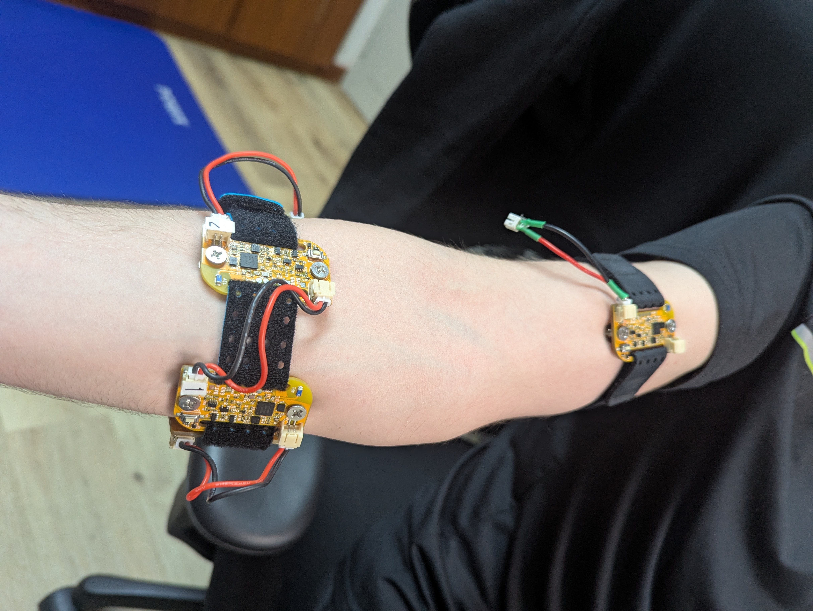

# Real Time Gesture Control System for Precision Control

This project implements real-time gesture classification using the [uMyo EMG sensors](https://udevices.io/products/umyo-wearable-emg-sensor). The system is designed to be used for precision control applications, such as controlling a robotic arm or a drone. On that front we implemented two demos controlling a simulation drone via Ardupilot Gazebo simulation and a Ryze Tello drone in real life.

The project was implemented as part of the Pervasive Computing Lab course (24W) at the University of Klagenfurt.

## Table of Contents

- [Setup](#setup)
- [Sensor placement](#sensor-placement)
- [Data collection](#data-collection)
- [Training](#training)
- [Inference](#inference)
  - [Classifier](#classifier)
  - [Drone control simulation](#drone-control-simulation)
  - [Drone control real life](#drone-control-real-life)
- [Project members](#project-members)

## Setup

Clone the repository:
```bash
git clone https://github.com/Incomprehensible/Real-Time-Gesture-Control-System-for-Precision-Control
```

Install the required packages:
```bash
pip install -r requirements.txt
```

## Sensor placement

For the project we used five uMyo sensors. Four of them were placed on the forearm and one on the bicep. The sensors were placed as follows:



By default uMyo data arrives in the order the sensors are started. To keep the order consistent without having to relie on the order the sensors are started, we saved the ids of each sensors and associate the data based on the `unit_id`. These `IDS` need to be replace in the [uMyo_python_tools/parameters.py file](uMyo_python_tools\parameters.py).

## Data collection

Data collection can be done using the [`record_data.py` script](uMyo_python_tools\record_data.py). The script will receive the data from the [uMyo USB receiver base](https://udevices.io/products/usb-receiver-base) and saves it to a file.

Usage:
```bash
usage: record_data.py [-h] [--output OUTPUT] [--num_sensors NUM_SENSORS] [-p PORT]

Record data from uMyo

options:
  -h, --help            show this help message and exit
  --output OUTPUT       Output file to save sensor data
  --num_sensors NUM_SENSORS
                        Number of sensors to record
  -p PORT, --port PORT  USB receiving station port
```

Example
```bash
python uMyo_python_tools/record_data.py --num_sensors 5 --output recordings/23_02_25/data/person_open.csv -p /dev/ttyUSB0
```

## Training

Data exploration and training is done in the [gesture-recognition notebook](training/scripts/gesture-recognition.ipynb). It imports the preprocessing code from [preprocessing.py](uMyo_python_tools\preprocessing.py) to be consistent with the inference code and allows you to train a random forest (RF), feed-forward neural network (FFNN), LSTM, and transformer model.

After thorough testing, we found that feature extraction produces better real-time performance than using raw data. For feature extraction we're using [libEMG](https://github.com/LibEMG/libemg). Concretely we're using [Hjorth parameters](https://libemg.github.io/libemg/documentation/features/features.html#hjorth-parameters-hjorth-sup-17-sup) and [HTD](https://libemg.github.io/libemg/documentation/features/features.html#hudgin-s-time-domain-htd-sup-8-sup) which are time-domain based features.

## Inference

### Classifier

The base script for running inference is [classifier.py](uMyo_python_tools\classifier.py) which loads the trained model, collects data in a separate thread, and classifies the data in real-time.

Usage:
```bash
usage: classifier.py [-h] [--model_type {sklearn,torch,lstm,tf}] [--model_path MODEL_PATH] [--scaler_path SCALER_PATH]
                     [-g GESTURES [GESTURES ...]] [--window_size WINDOW_SIZE] [--prediction_delay PREDICTION_DELAY] [-p PORT]

Real-time classification of EMG data

options:
  -h, --help            show this help message and exit
  --model_type {sklearn,torch,lstm,tf}
                        Type of model to use for classification
  --model_path MODEL_PATH
                        Path to classifier
  --scaler_path SCALER_PATH
                        Path to scaler
  -g GESTURES [GESTURES ...], --gestures GESTURES [GESTURES ...]
                        Set of gestures
  --window_size WINDOW_SIZE
                        Size of the data window for predictions
  --prediction_delay PREDICTION_DELAY
                        Delay between predictions
  -p PORT, --port PORT  USB receiving station port
```

Example:
```bash
python uMyo_python_tools/classifier.py --model_type tf --model_path training/resources/transformer_model.pt --scaler_path training\resources\scaler_features.pkl --window_size 100
```

### Drone control simulation

The simulation demo uses Ardupilot SITL and Gazebo Harmonic.

Prerequisites:
- [Using SITL with Gazebo](https://ardupilot.org/dev/docs/sitl-with-gazebo.html)

The [control_drone.py file](uMyo_python_tools\control_drone.py) uses the `EMG_Inference` class from the [classifier.py](uMyo_python_tools/classifier.py) to get the gesture predictions and then controls the drone via [pymavlink](https://github.com/ArduPilot/pymavlink).

Control:
- Fist: Arming
- Up:
  - If landed: Takeoff
  - If flying: Increase altitude
- Down:
  - If flying: Decrease altitude
  - If below 0.5m: Land
- Lift: Move forward
- Peace: Turn clockwise

Demo video:
[](https://www.youtube.com/watch?v=U0_3AHrRv6E)

### Drone control real life

Similar to the simulation demo but using the [Ryze Tello drone](https://www.ryzerobotics.com/tello). The drone is controlled via [djitellopy](https://github.com/damiafuentes/DJITelloPy) - a Python wrapper for the Tello SDK. Controls are identical to the simulation demo only that arming isn't needed and therefore fist is used for takeoff instead.

Demo video:
[](https://www.youtube.com/watch?v=tX6MDHnbGV8)

## Project members

- Nadezhda Varzonova
- Gilbert Tanner
