# Hardware comparison

## Introduction

When starting the project we did a analysis of the available hardware options for the project. The main requirements for the hardware were:
- Low latency
- Affortable price
- Fast setup time and high flexibility

The main hardware options we considered were:
- [uMyo EMG sensor](https://udevices.io/products/umyo-wearable-emg-sensor)
- Myo Thalmic Labs armband (discontinued)
- [MYOWARE 2.0](https://myoware.com/)
- [BioAmp EXG Pill](https://github.com/upsidedownlabs/BioAmp-EXG-Pill)

Considering the main requirements above we decided to go with the uMyo sensors as they use dry electrodes decreasing setup time and costs. They also already ship with a band to mount multiple sensors and a USB receiver base for easy data collection.
As [the university](https://www.aau.at/) also provided us with a MyoWare 2.0 Muscle Sensor Kit we also tested it. 

The main differences between the two sensors: 
* Connection
  * MyoWare requires either a wired connection for data transfer or a [BLE shield](https://learn.sparkfun.com/tutorials/getting-started-with-the-myoware-20-muscle-sensor-ecosystem/myoware-20-wireless-shield) for wireless transmission. 
  * The uMyo sensors are completely wireless. Data can be received with 3 modes. One is compatible with Arduino nRF24 radio but is limited in bandwidth. The second mode enables transmission via BLE and can be used with ESP32. The last mode provides the highest bandwidth possible, sends all the data from the sensor and requires the nRF5x radio. We used the last mode with the plug-and-play [USB receiver base](https://udevices.io/products/umyo-wearable-emg-sensor) offered by uDevices.
* Electrodes type
  * MyoWare uses wet electrodes which require a gel to be applied to the skin. This increases setup time and costs as the electrode needs to be replaced after each use. MyoWare also provides a [cable shield](https://learn.sparkfun.com/tutorials/getting-started-with-the-myoware-20-muscle-sensor-ecosystem/myoware-20-cable-shield) and a cable for external sensor placement (included in the [Muscle Sensor Development Kit](https://www.sparkfun.com/myoware-2-0-muscle-sensor-development-kit.html)) making it possible to measure remote signals. Additionally they also provide a external [reference cable](https://learn.sparkfun.com/tutorials/getting-started-with-the-myoware-20-muscle-sensor-ecosystem/myoware-20-reference-cable) to put the reference electrode further away from the other electrodes instead of using the third electrode connector on the sensor but using this requires additional effort.
  * As mentioned previously uMyo sensors allow for dry electrodes that can be reused but they also provide an opportunity to use wet electrodes. However for this one needs to manually solder the electrodes to the pads requiring additional effort for setup and making it troublesomes to switch back and forth between dry and wet electrodes.
* Preprocessing
  * The MyoWare sensors have a preprocessing pipeline onboard which constitutes of a proper signal filtering, adjusted amplification and output signal shaping. It is a great advantage as it reduces the computational load on the PC. A adjustable gain potentiometer on the sensor PCB gives more freedom to tune the signal for the user but it's not convenient to adjust it during signal acquisition and code testing. Additionally in our case, raw and envelope signals required different gains. 
  * The uMyo sensor provides a raw signal which needs to be processed on the PC and can only be received via NRF52 radio due to bandwidth constraints. Additionally it also provides a frequency-domain signal consisting of 4 one-sided FFT bins. Overall the user is more in control of the data processing pipeline.
* Output data type
  * MyoWare provides 3 types of output signal: raw, rectified and envelope. We found the envelope to be the most useful.
  * uMyo provides raw and frequency-domain signals. The frequency-domain signal is limited in frequency resolution.
* Other sensors onboard
  * uMyo sensors each have an onboard 9-DOF IMU.
* Sampling rate
  * MyoWare sensor is analog so the sample rate is dependent on the device you're using to measure it. 
  * uMyo sensors have a fixed sampling rate which is sufficient for the band of interest.
* Signal quality issues
  * MyoWare sensors are susceptible to noise and interference due to the wired connection to the PC. Unplugging the laptop from the mains power didn't solve the issues with raw EMG measurements. Cable movements affect the measurements as well. Even when braiding the electrode cable to reduce noise we only achieved subpar results with the MyoWare. Envelope signal has better SNR and can be used to quantify muscle power output but requires gain adjustment for the user. We also noticed strange grounding issues with the MyoWare sensor - the signal quality gets better if the user touches the metallic case of the unplugged laptop with one hand.
  * uMyo raw EMG signal suffers from ECG signal interference. Most of the power is coming from it but can still be filtered out. The frequency-domain signal is less susceptible to ECG interference but has a lower frequency resolution.
* Helper software
  * MyoWare provides basic examples which help testing their hardware.
  * uMyo provide more scripts to test, visualize the signal and even play small games using EMG signals. However, the quality of the code is debatable.

Here we break down the `pros` and `cons` of these two sensors:
| Sensor Type | Pros | Cons |
|-------------|------|------|
| uMyo EMG Sensor | - Dry electrodes reduce setup time and costs - Comes with a band for mounting multiple sensors - USB receiver base for easy data collection - Completely wireless with multiple transmission modes - Onboard 9-DOF IMU  - More wet electrodes provided in the kit  - Open source | - Requires manual soldering for wet electrodes - Raw signal requires processing on PC  - Data rate drops with more active sensors  - Firmware repositories are not timely updated |
| MyoWare 2.0 Muscle Sensor | - Potential for wireless transmission with additional shield - Onboard preprocessing pipeline reduces computational load on PC - Provides multiple output signal types - Adjustable gain  - Different cable types | - Higher initial cost  - Wet electrodes increase setup time and costs - Requires cables preparation and noiseless setup without mains connection  - Wired connection susceptible to noise and interference - Cable movements affect measurements - Wireless shield not included in the kit  - Not open source |

## Setup
* MyoWare sensors

    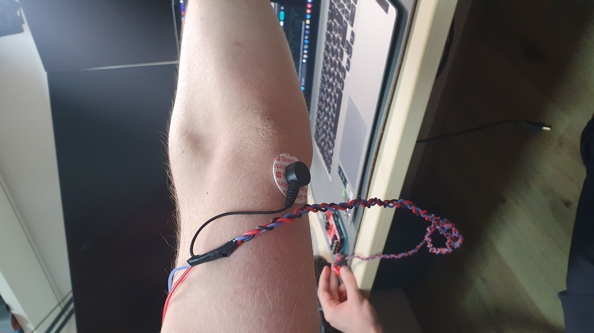
    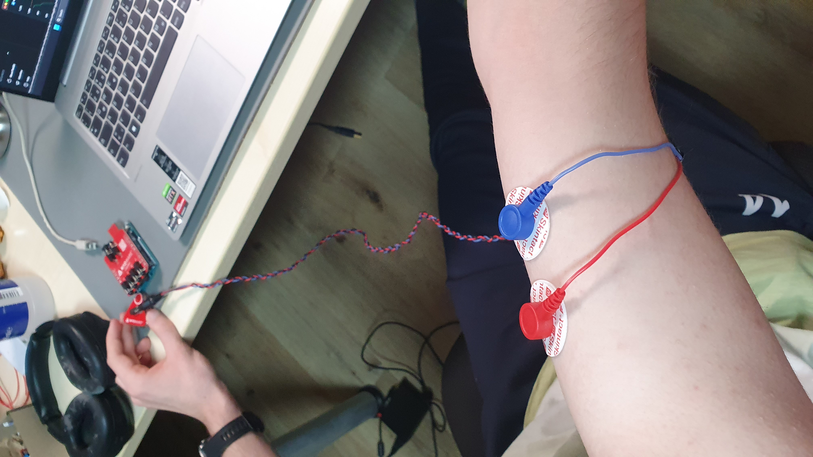

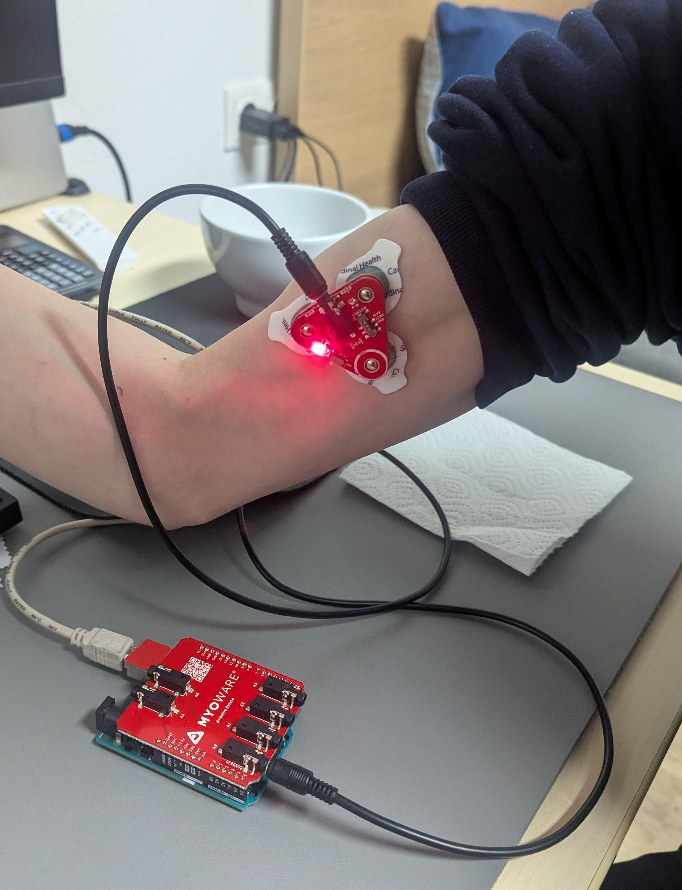

* uMyo sensors
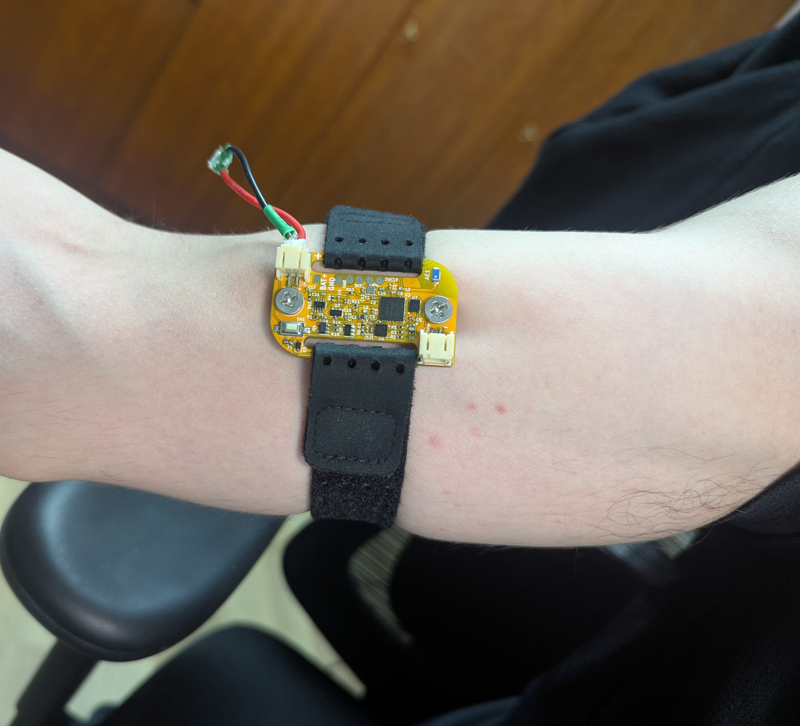

## Signal visualization and Power Spectrum Density (PSD)
* MyoWare sensors

| MyoWare Raw EMG | MyoWare Envelope EMG |
|------------------------------|-------------|
| 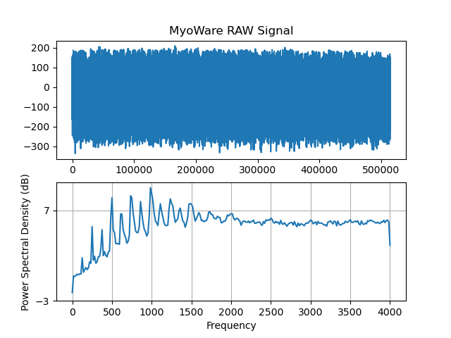 | 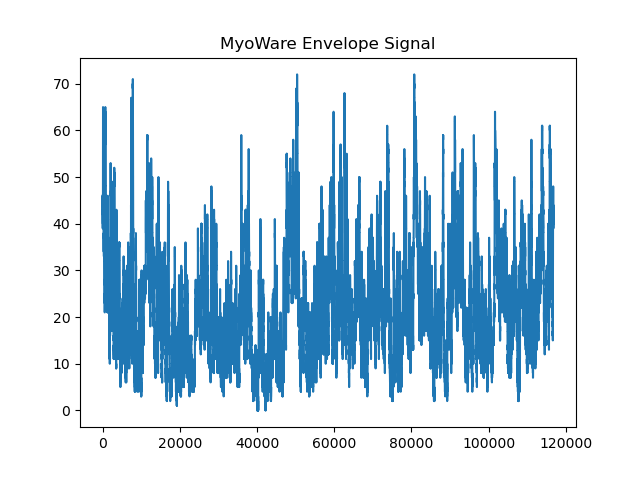 |
| 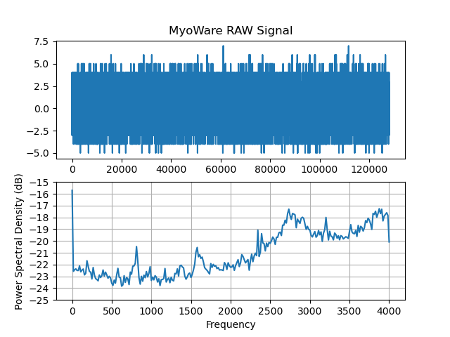 | 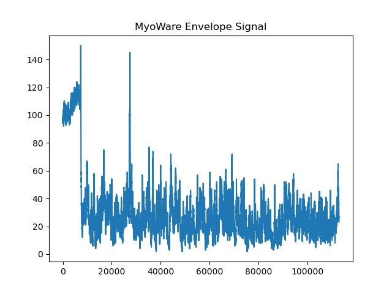 |

* uMyo sensors

| uMyo Raw EMG | uMyo Raw EMG |
|---------------------------|----------|
| 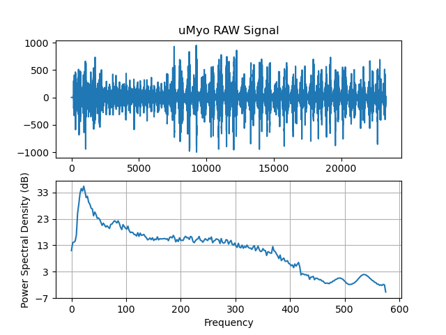 | 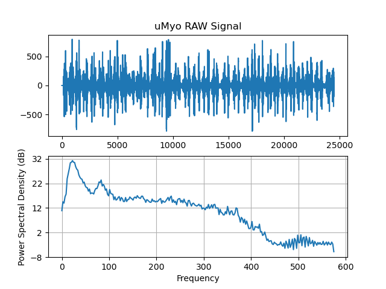 |

## Gestures example recordings and PSD
* uMyo sensors

| Fist | Up | Lift |
|------|-------|----|
| 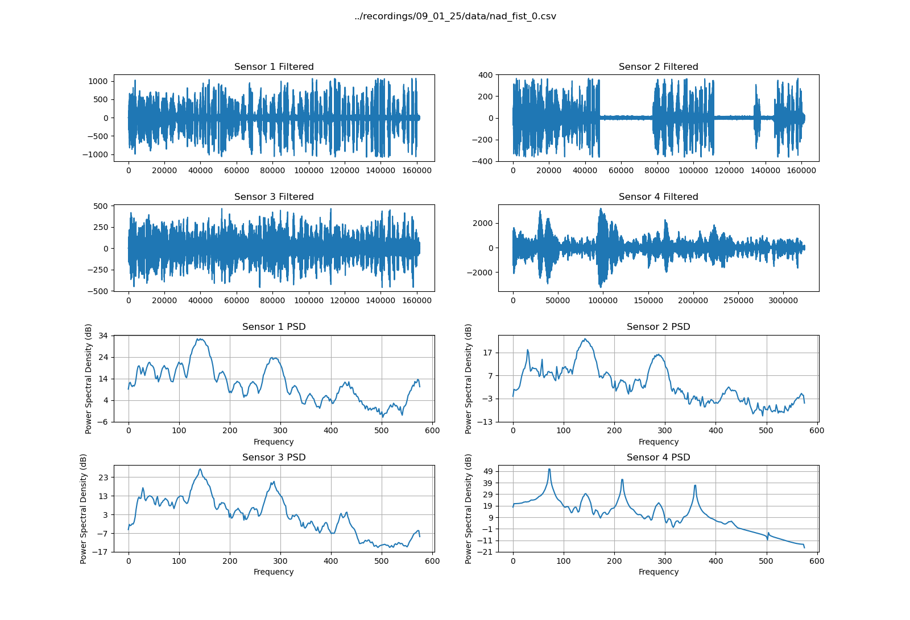 | 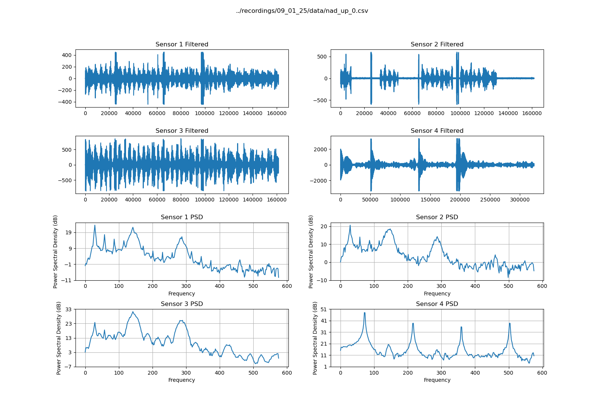 | 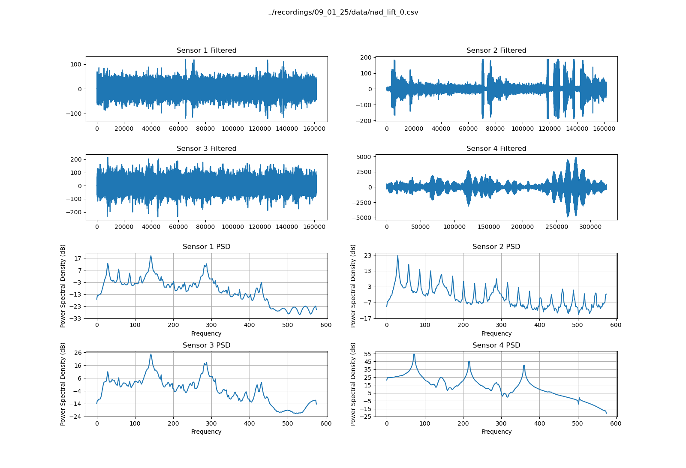 |